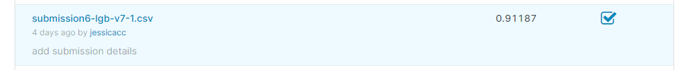
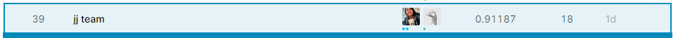
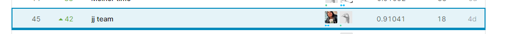

# Woman in Data Science Datathon 2020 - Datathon
Code used to solve Kaggle competition on WiDS Datathon 2020

Competition Link: https://www.kaggle.com/c/widsdatathon2020

Team Members: 
    [@jungoncalves](https://github.com/jungoncalves)

## Best model: ##
- LGB - Version 7
    - [link to notebook](./6-lgb-v6/)
    

    
     
    

### Public Leaderboard ###

    
     
    

### Private Leaderboard ###

    
     
     
    

